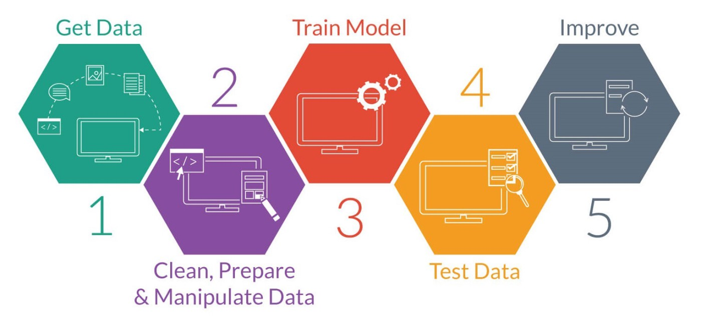

# Seminar Data Mining Matematika UB
Repo ini dibuat untuk memenuhi kebutuhan peserta untuk belajar dan mengerti beberapa algoritma machine learning yang digunakan dalam metode data mining. 

#### -- Project Status: [~in progress]

#### TO DO 
- [ ] make pipeline for latihan_sendiri 
- [ ] answer sheet for latihan_Sendiri
- [x] slides 
  - [x] algorithm pseudocode 
  - [x] visualization 
- [ ] kasih capture dari source kmeans, svm, dan hierarchical clustering 
- [ ] source code dari sklearn buat ke slidenya pak muklash 
  - [ ] svm
  - [ ] hierarchical 
  - [ ] k-means
  - [ ] gmm 
- [ ] buat animasi iterasi dari kmeans  

### Contributor
* [Dr. Imam Mukhlash, S.Si, MT.](https://www.researchgate.net/profile/Imam_Mukhlash)
* [Sumihar Christian](github.com/svmihar)

### Methods Used
* Klasifikasi
  * SVM 
    * linear
    * non-linear
  * Bayesian Network 
    * Multinomial Navie Bayes
* Clustering
  * K-Means
    * Cek Konvergensi
  * Gaussian Mixture
* Data Visualization Methods using Matplotlib

### Technologies
* Python 
  * pandas
  * matplotlib
  * scikit-learn

## Getting Started

1. Clone this repo (for help see this [tutorial](https://help.github.com/articles/cloning-a-repository/)).
2. Raw Data is being kept [here](Repo folder containing raw data) within this repo.

    *If using offline data mention that and how they may obtain the data from the froup)*
    
3. Data processing/transformation scripts are being kept [here](Repo folder containing data processing scripts/notebooks)
4. etc...

*If your project is well underway and setup is fairly complicated (ie. requires installation of many packages) create another "setup.md" file and link to it here*  

5. Follow setup [instructsions](Link to file)

## Referensi
* [Notebook/Markdown/Slide Deck Title](link)
* [Notebook/Markdown/Slide DeckTitle](link)
* [Blog Post](link)

## Contact
* If you haven't joined the SF Brigade Slack, [you can do that here](http://c4sf.me/slack).  
* Our slack channel is `#datasci-projectname`
* Feel free to contact team leads with any questions or if you are interested in contributing!