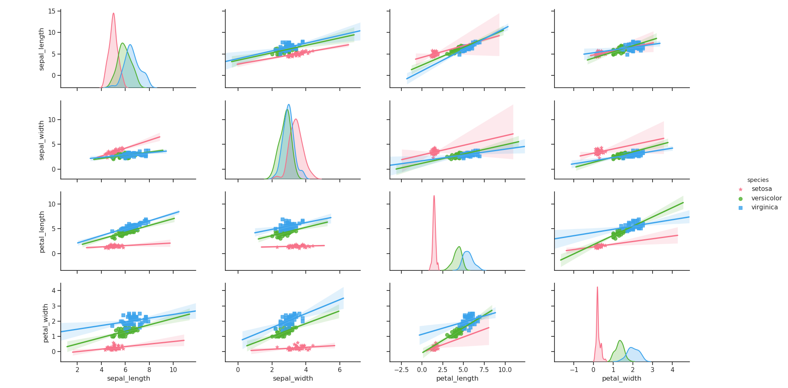
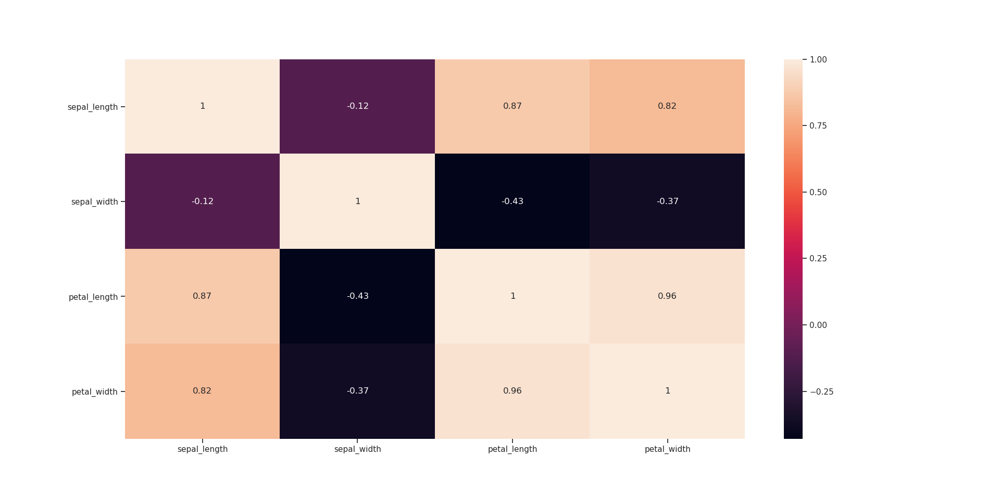
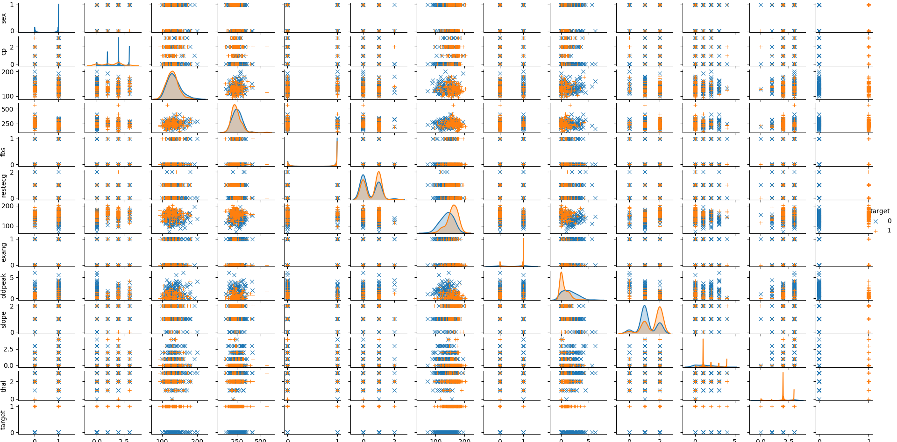
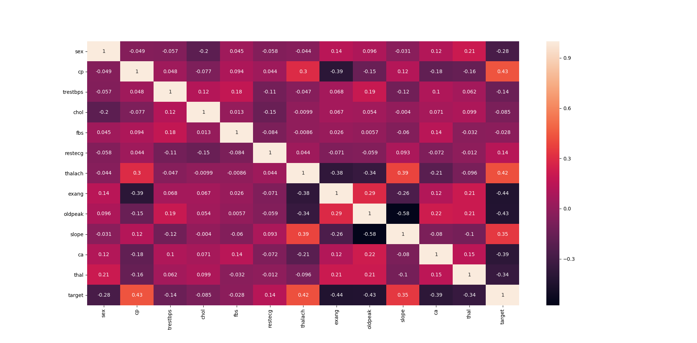

### informasi dataset: 
* **age**:age in years   
* **sex**: (1 = male; 0 = female)   
* **cp**:chest pain type   
* **trestbps**: resting blood pressure (in mm Hg on admission to the hospital)
* **cholserum**: cholestoral in mg/dl   
* **fbs**: (fasting blood sugar > 120 mg/dl) (1 = true; 0 = false)   
* **restecg**: resting electrocardiographic results   
* **thalach**: maximum heart rate achieved   
* **exang**: exercise induced angina (1 = yes; 0 = no)   
* **oldpeak**: ST depression induced by exercise relative to rest   
* **slope**: the slope of the peak exercise ST segment   
* **ca**: number of major vessels (0-3) colored by flourosopy   
* **thal**: 3 = normal; 6 = fixed defect; 7 = reversable defect   
* **target**: 1 or 0   

### sumber
[UCI Heart Disease](https://www.kaggle.com/ronitf/heart-disease-uci)

## pairplot
### iris


### heart disease


```python
Performing model optimizations...

Estimator: Logistic Regression
Best params: {'clf__C': 0.1, 'clf__penalty': 'l2', 'clf__solver': 'liblinear'}
Best training accuracy: 0.826
Test set accuracy score for best params: 0.836

Estimator: Logistic Regression w/PCA
Best params: {'clf__C': 1.0, 'clf__penalty': 'l1', 'clf__solver': 'liblinear'}
Best training accuracy: 0.822
Test set accuracy score for best params: 0.820

Estimator: Random Forest
Best params: {'clf__criterion': 'gini', 'clf__max_depth': 3, 'clf__min_samples_leaf': 8, 'clf__min_samples_split': 2}
Best training accuracy: 0.843
Test set accuracy score for best params: 0.869

Estimator: Random Forest w/PCA
Best params: {'clf__criterion': 'entropy', 'clf__max_depth': 6, 'clf__min_samples_leaf': 10, 'clf__min_samples_split': 2}
Best training accuracy: 0.818
Test set accuracy score for best params: 0.869

Estimator: Support Vector Machine
Best params: {'clf__C': 2, 'clf__kernel': 'rbf'}
Best training accuracy: 0.814
Test set accuracy score for best params: 0.885

Estimator: Support Vector Machine w/PCA
Best params: {'clf__C': 1, 'clf__kernel': 'linear'}
Best training accuracy: 0.818
Test set accuracy score for best params: 0.820
```
